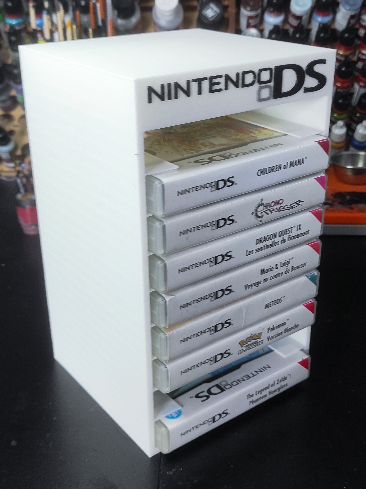

# Étagere de jeu paramétrique

Voici mes étageres pour ranger les jeux. Il s'agit d'un model OpenSCAD paramétrique. 

## 3DS

* [Fichier 3mf](3DS-Holder.3mf)
* [Fichier stl](3DS-Holder.stl)

## DS

* [Fichier 3mf](DS-Holder.3mf)
* [Fichier stl](DS-Holder.stl)

## SNES

* [Fichier 3mf](SNES-Holder.3mf)
* [Fichier stl](SNES-Holder.stl)

